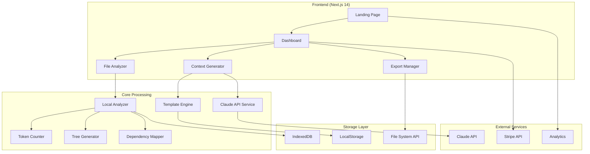

# ContextViber Architecture Design Document
*Version 1.0.0 | 2025-01-10*

## 🏗️ System Architecture



## 📦 Technology Stack

### Frontend
```yaml
framework: Next.js 14.2.3
ui_library: React 18.2.0
styling: 
  - Tailwind CSS 3.4.0
  - PostCSS 8.4.31
  - Autoprefixer 10.4.16
typescript: 5.3.3
state_management: Zustand 4.5.0
forms: React Hook Form 7.49.0
animations: Framer Motion 11.0.0
```

### Backend (Next.js API Routes)
```yaml
runtime: Node.js 20.x
database: None (client-side storage)
authentication: NextAuth.js 4.24.0
payment: Stripe SDK 14.0.0
ai_integration: Anthropic SDK 0.17.0
file_processing: 
  - formidable 3.5.0
  - file-type 19.0.0
```

## 🗂️ Project Structure

```
contextviber/
├── src/
│   ├── app/                      # Next.js App Router
│   │   ├── (marketing)/         # Public pages
│   │   │   ├── page.tsx        # Landing page
│   │   │   ├── pricing/        # Pricing page
│   │   │   └── docs/           # Documentation
│   │   ├── (app)/              # Protected pages
│   │   │   ├── dashboard/      # Main application
│   │   │   ├── projects/       # Project management
│   │   │   └── settings/       # User settings
│   │   └── api/                # API routes
│   │       ├── analyze/        # File analysis
│   │       ├── generate/       # Context generation
│   │       ├── ai/            # Claude integration
│   │       └── webhooks/      # Stripe webhooks
│   │
│   ├── components/              # React components
│   │   ├── ui/                # Reusable UI components
│   │   ├── features/          # Feature-specific components
│   │   └── layouts/           # Layout components
│   │
│   ├── lib/                    # Core business logic
│   │   ├── analyzers/         # File analysis modules
│   │   │   ├── FileTreeAnalyzer.ts
│   │   │   ├── TokenCounter.ts
│   │   │   ├── DependencyMapper.ts
│   │   │   └── ImportanceScorer.ts
│   │   ├── generators/        # Output generators
│   │   │   ├── StatusGenerator.ts
│   │   │   ├── MermaidGenerator.ts
│   │   │   ├── TreeGenerator.ts
│   │   │   └── ContextPackager.ts
│   │   ├── ai/               # AI services
│   │   │   ├── ClaudeService.ts
│   │   │   ├── PromptBuilder.ts
│   │   │   └── ResponseParser.ts
│   │   └── storage/          # Storage management
│   │       ├── CacheManager.ts
│   │       ├── ProjectStore.ts
│   │       └── HistoryTracker.ts
│   │
│   ├── hooks/                 # Custom React hooks
│   ├── utils/                 # Utility functions
│   ├── types/                 # TypeScript definitions
│   └── styles/               # Global styles
│
├── public/                    # Static assets
├── tests/                     # Test files
└── config/                    # Configuration files
```

## 🔄 Data Flow Architecture

### 1. File Upload Flow
```typescript
interface FileUploadFlow {
  // Step 1: User uploads files
  input: File[] | DragEvent
  
  // Step 2: Validate and parse
  validation: {
    maxSize: "50MB",
    allowedTypes: ["text/*", "application/*"],
    excludePatterns: ["node_modules", ".git"]
  }
  
  // Step 3: Local analysis
  analysis: {
    structure: FileTree,
    dependencies: DependencyGraph,
    tokens: TokenCount,
    importance: ImportanceScore[]
  }
  
  // Step 4: Generate outputs
  outputs: {
    fileTree: string,
    mermaidDiagram: string,
    statusMd: string,
    contextPackage: ContextData
  }
}
```

### 2. AI Enhancement Flow (Pro Feature)
```typescript
interface AIEnhancementFlow {
  // Step 1: Prepare context
  preparation: {
    files: SelectedFiles[],
    userQuery: string,
    projectHistory: History[]
  }
  
  // Step 2: Check cache
  cache: {
    key: string,
    ttl: 3600, // 1 hour
    strategy: "LRU"
  }
  
  // Step 3: Claude API call
  apiCall: {
    model: "claude-3-haiku-20240307",
    maxTokens: 4000,
    temperature: 0.3
  }
  
  // Step 4: Process response
  processing: {
    parse: ResponseData,
    validate: boolean,
    enhance: EnhancedContext
  }
  
  // Step 5: Update cache
  caching: {
    store: IndexedDB,
    compress: true,
    encrypt: false
  }
}
```

## 💾 Storage Architecture

### Client-Side Storage Strategy
```javascript
// IndexedDB - Main storage (50MB+)
{
  projects: {
    id: string,
    name: string,
    files: FileData[],
    analysis: AnalysisResult,
    history: ContextHistory[],
    created: Date,
    updated: Date
  }
}

// LocalStorage - Settings (5MB)
{
  preferences: {
    theme: "dark" | "light",
    defaultView: "tree" | "list",
    aiModel: "haiku" | "sonnet"
  },
  recentProjects: string[],
  apiUsage: {
    tokens: number,
    requests: number,
    lastReset: Date
  }
}

// SessionStorage - Temporary data
{
  currentAnalysis: AnalysisResult,
  uploadQueue: File[],
  unsavedChanges: boolean
}
```

## 🔐 Security Architecture

### Security Measures
```yaml
client_side:
  - Content Security Policy (CSP)
  - XSS protection
  - Input sanitization
  - File type validation
  - Size limits enforcement

api_security:
  - Rate limiting (100 req/hour)
  - API key validation
  - CORS configuration
  - Request signing
  - Webhook verification

data_privacy:
  - No server storage of code
  - Client-side processing
  - Encrypted API transmission
  - No training on user data
  - GDPR compliant
```

## 🎯 Core Modules Design

### 1. FileTreeAnalyzer
```typescript
class FileTreeAnalyzer {
  private excludePatterns = [
    'node_modules',
    '.git',
    '.next',
    'dist',
    'build'
  ]
  
  analyze(files: File[]): FileTree {
    // Build hierarchical structure
    // Calculate directory sizes
    // Identify file types
    // Generate tree visualization
  }
  
  generateTextTree(tree: FileTree): string {
    // Convert to ASCII art tree
    // Apply indentation
    // Add file icons
  }
}
```

### 2. TokenCounter
```typescript
class TokenCounter {
  private encodings = {
    'gpt-4': tiktoken.get_encoding('cl100k_base'),
    'claude': customClaudeEncoder
  }
  
  count(text: string, model: AIModel): TokenCount {
    // Select appropriate encoder
    // Count tokens
    // Calculate cost
    // Provide optimization suggestions
  }
  
  optimizeForTokens(files: File[]): OptimizedPackage {
    // Remove comments
    // Minify code
    // Extract relevant sections
    // Maintain readability
  }
}
```

### 3. ContextPackager
```typescript
class ContextPackager {
  package(analysis: Analysis, options: PackageOptions): ContextPackage {
    return {
      summary: this.generateSummary(analysis),
      keyFiles: this.selectKeyFiles(analysis),
      dependencies: this.mapDependencies(analysis),
      recentChanges: this.extractChanges(analysis),
      instructions: this.buildInstructions(options),
      metadata: {
        timestamp: new Date(),
        version: '1.0.0',
        tokens: this.calculateTokens()
      }
    }
  }
}
```

## 🚀 Deployment Architecture

```yaml
infrastructure:
  hosting: Vercel
  domain: contextviber.com
  cdn: Vercel Edge Network
  
environment_variables:
  NEXT_PUBLIC_APP_URL: https://contextviber.com
  ANTHROPIC_API_KEY: [encrypted]
  STRIPE_SECRET_KEY: [encrypted]
  STRIPE_WEBHOOK_SECRET: [encrypted]
  
deployment_pipeline:
  1. GitHub push to main
  2. Vercel automatic deployment
  3. Preview deployment for PRs
  4. Production deployment on merge
  
monitoring:
  - Vercel Analytics
  - Sentry error tracking
  - PostHog usage analytics
  - Stripe billing metrics
```

## 📈 Performance Optimization

### Frontend Optimization
- Code splitting with dynamic imports
- Image optimization with next/image
- Font optimization with next/font
- Lazy loading for heavy components
- React.memo for expensive renders
- Virtual scrolling for large lists

### API Optimization
- Response caching (1 hour TTL)
- Request batching for multiple files
- Streaming responses for large data
- Compression with gzip/brotli
- Rate limiting per user/IP

### Bundle Size Targets
```yaml
initial_load: < 200KB
lazy_chunks: < 100KB each
total_size: < 1MB
lighthouse_score: > 90
```

---
*This design document is version controlled and updated with each major release*